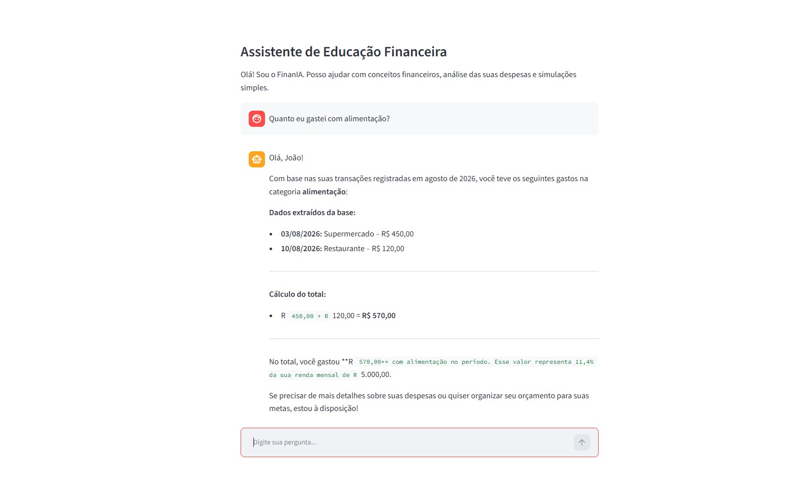
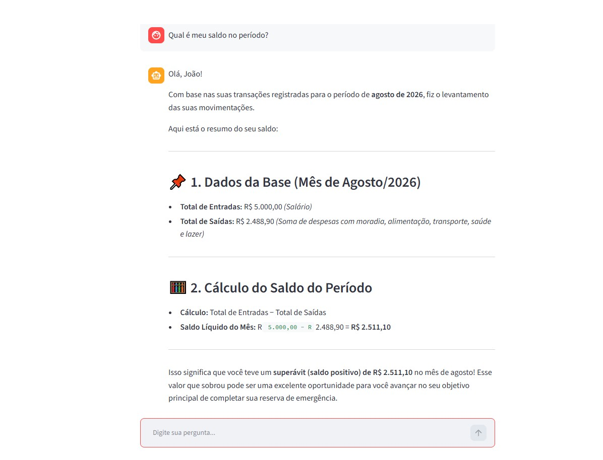
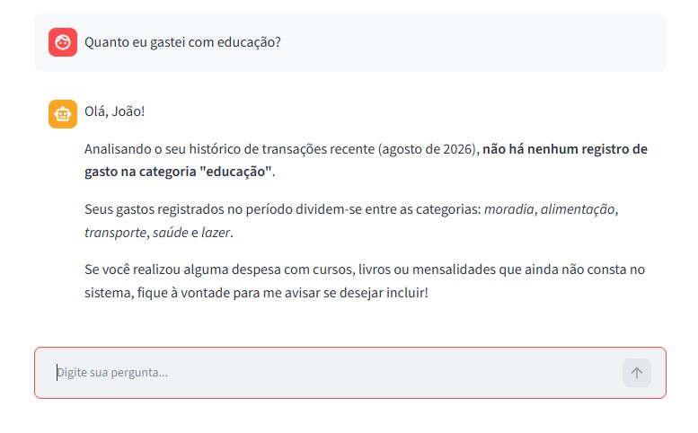

# 💜 FinanIA — Assistente de Educação Financeira com IA

O **FinanIA** é um assistente virtual de educação financeira desenvolvido como projeto prático de Inteligência Artificial Generativa.

A aplicação combina uma **base de conhecimento estruturada em arquivos JSON e CSV**, processamento de dados com Python e um modelo de linguagem da família Gemini para responder perguntas de forma contextualizada.

O projeto foi desenvolvido com foco em **educação financeira, análise de despesas e simulações simples**, mantendo uma abordagem responsável e evitando recomendações financeiras definitivas.

---

## 🎯 Objetivo

Criar um assistente capaz de interpretar informações financeiras estruturadas e responder perguntas em linguagem natural, utilizando os dados disponíveis na base de conhecimento.

O FinanIA pode:

* 💰 analisar receitas e despesas;
* 📊 calcular saldo e totais por categoria;
* 📚 explicar conceitos financeiros;
* 🏦 apresentar informações sobre produtos financeiros cadastrados;
* 🎯 consultar metas financeiras;
* 💬 manter uma conversa por meio de uma interface de chat;
* 🧮 realizar cálculos e simulações simples.

---

## 🧠 Como funciona

O funcionamento do FinanIA pode ser representado pelo seguinte fluxo:

**Usuário → Streamlit → Base de conhecimento → Gemini → Resposta contextualizada**

1. O usuário envia uma pergunta pela interface.
2. A aplicação carrega os dados disponíveis na base de conhecimento.
3. As informações relevantes são incluídas no contexto enviado ao modelo.
4. O Gemini interpreta a pergunta considerando esse contexto.
5. A resposta é apresentada ao usuário através da interface do Streamlit.

---

## 📚 Base de conhecimento

A aplicação utiliza dados simulados organizados em arquivos estruturados:

### `perfil_usuario.json`

Contém informações como:

* perfil do usuário;
* renda mensal;
* patrimônio;
* reserva de emergência;
* objetivos financeiros;
* metas.

### `transacoes.csv`

Contém registros de:

* receitas;
* despesas;
* categorias;
* datas;
* valores;
* tipo da movimentação.

### `produtos_financeiros.json`

Contém informações educacionais sobre produtos financeiros, como:

* Tesouro Selic;
* CDB;
* LCI/LCA;
* fundos multimercado;
* fundos de ações.

### `historico_atendimento.csv`

Registra exemplos de atendimentos anteriores, incluindo:

* tema;
* canal;
* resumo;
* situação do atendimento.

> Os dados utilizados no projeto são **fictícios e destinados exclusivamente à demonstração**.

---

## 🤖 Inteligência Artificial

O projeto utiliza o **Gemini 3.6 Flash** através da biblioteca `google-genai`.

O modelo recebe um contexto construído a partir da base de conhecimento e segue instruções específicas para:

* utilizar os dados disponíveis;
* não inventar informações;
* informar quando um dado não estiver disponível;
* diferenciar dados, cálculos e simulações;
* explicar conceitos de maneira simples;
* evitar recomendações definitivas de investimento;
* não solicitar senhas ou informações bancárias sensíveis.

---

## 💻 Tecnologias utilizadas

* **Python**
* **Google Gemini**
* **Google GenAI SDK**
* **Pandas**
* **Streamlit**
* **Google Colab**
* **ngrok**
* **JSON**
* **CSV**
* **Git**
* **GitHub**

---

## 📁 Estrutura do projeto

```text
FinanIA-Assistente-Financeiro-IA/
│
├── README.md
│
├── data/
│   ├── historico_atendimento.csv
│   ├── perfil_usuario.json
│   ├── produtos_financeiros.json
│   └── transacoes.csv
│
├── docs/
│   ├── 01-documentacao-agente.md
│   ├── 02-base-conhecimento.md
│   ├── 03-prompts.md
│   ├── 04-metricas.md
│   └── 05-pitch.md
│
└── src/
    ├── .gitkeep
    └── app.py
```

---

## 💬 Exemplos de perguntas

O FinanIA foi testado com diferentes tipos de perguntas para verificar sua capacidade de consultar a base de conhecimento, realizar cálculos e lidar com informações que não estão disponíveis.

### 📊 Análise de despesas

**Pergunta:**

> Quanto eu gastei com alimentação?

O agente consulta as transações disponíveis e identifica os gastos relacionados à categoria de alimentação.



---

### 🧮 Cálculo do saldo

**Pergunta:**

> Qual é meu saldo no período?

O agente utiliza as receitas e despesas presentes na base para calcular o saldo do período.



---

### 🛡️ Tratamento de informação inexistente

**Pergunta:**

> Quanto eu gastei com educação?

Não existe uma transação de educação na base utilizada no projeto. O FinanIA deve informar que esse dado não está disponível, evitando inventar informações.



---

## 📊 Exemplo de resultado

Com os dados simulados utilizados no projeto:

**Receitas:** R$ 5.000,00

**Despesas:** R$ 2.488,90

**Saldo do período:** R$ 2.511,10

**Gastos com alimentação:** R$ 570,00

Esses valores são calculados a partir das transações presentes na base de conhecimento.

---

## 🛡️ Segurança e responsabilidade

O FinanIA foi projetado como uma ferramenta **educacional e demonstrativa**.

A aplicação:

* não acessa contas bancárias reais;
* não executa transações financeiras;
* não solicita senhas;
* não utiliza dados bancários reais;
* não substitui um profissional especializado;
* não deve ser utilizada como única base para decisões de investimento.

As informações sobre produtos financeiros presentes na base são **dados simulados para o projeto** e não representam necessariamente condições atuais de mercado.

---

## 🔐 Gerenciamento da API Key

A chave de acesso ao Gemini **não é armazenada no código-fonte nem no repositório público**.

Durante o desenvolvimento no Google Colab, a chave é armazenada como Secret e disponibilizada à aplicação por variável de ambiente.

Dessa forma, informações sensíveis não precisam ser publicadas no GitHub.

---

## 🚀 Execução

O projeto foi desenvolvido e testado no **Google Colab**.

Após configurar a API Key do Gemini, a aplicação pode ser executada utilizando o Streamlit:

```bash
streamlit run src/app.py
```

Para demonstração externa durante o desenvolvimento, foi utilizado o **ngrok** para disponibilizar temporariamente a aplicação através de um endereço público.

---

## 📖 Documentação

Mais detalhes sobre o desenvolvimento estão disponíveis na pasta [`docs/`](docs/):

* [Documentação do agente](docs/01-documentacao-agente.md)
* [Base de conhecimento](docs/02-base-conhecimento.md)
* [Prompts](docs/03-prompts.md)
* [Métricas](docs/04-metricas.md)
* [Pitch](docs/05-pitch.md)

---

## 🎓 Projeto

Projeto desenvolvido como atividade prática de **Inteligência Artificial Generativa**, aplicando conceitos de:

* Engenharia de Prompt;
* processamento de dados;
* integração com modelos de linguagem;
* construção de agentes de IA;
* desenvolvimento de interfaces;
* organização de bases de conhecimento;
* boas práticas de segurança.

---

## 👩‍💻 Autora

**Maisa Reis**

Projeto desenvolvido para fins educacionais e de portfólio.
